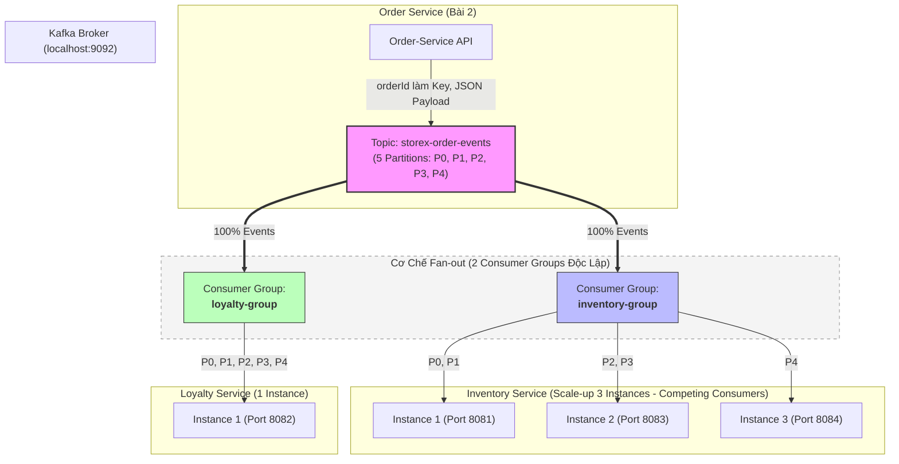

# BÀI THỰC HÀNH 3: CƠ CHẾ FAN-OUT VÀ LẮNG NGHE SỰ KIỆN (EVENT CONSUMER)
**Môn học: IT214 - Thiết kế hệ thống Microservices**

---

## 1. TÊN BÀI
**Triển khai Kafka Consumer theo mô hình Fan-out cho Inventory Service và Loyalty Service**

---

## 2. MỤC TIÊU
1. **Mô hình Fan-out (Publish/Subscribe):** Cả hai microservice độc lập là `inventory-service` và `loyalty-service` đều phải nhận được **100% sự kiện** từ topic `storex-order-events`.
2. **Khắc phục triệt để BUG-04:** Hai service tuyệt đối không dùng chung một Consumer Group ID.
3. **Phân biệt ranh giới Consumer Group:** 
   - Giữa các service khác nhau: Dùng các Consumer Group khác nhau để nhân bản sự kiện (Fan-out).
   - Trong cùng một service: Dùng chung một Consumer Group để chia sẻ tải trọng (Competing Consumers).
4. **Mở rộng quy mô (Scale-up) theo REQ-01:** Thiết kế để `inventory-service` có thể chạy đồng thời 3 instance cùng chia sẻ 5 partition của topic `storex-order-events`.
5. **Cấu hình Deserializer chuẩn xác:** Tự động deserialize dữ liệu JSON từ Kafka thành Java Object (`OrderCreatedEvent`), xử lý khác biệt package giữa Producer và Consumer.

---

## 3. KIẾN TRÚC HỆ THỐNG



---

## 4. KAFKA TOPIC
- **Tên Topic:** `storex-order-events`
- **Địa chỉ Broker:** `localhost:9092`
- **Số lượng Partition:** `5 partitions` (Partition 0, 1, 2, 3, 4)
- **Replication Factor:** `1`

---

## 5. INVENTORY GROUP-ID
- **Group ID cấu hình:** `inventory-group`
- Tất cả các instance của `inventory-service` (Instance 1, Instance 2, Instance 3) đều bắt buộc cấu hình chung `group-id: inventory-group`.

---

## 6. LOYALTY GROUP-ID
- **Group ID cấu hình:** `loyalty-group`
- Dịch vụ `loyalty-service` sử dụng riêng `group-id: loyalty-group`.

---

## 7. GIẢI THÍCH CƠ CHẾ FAN-OUT
- **Định nghĩa:** Fan-out là mô hình phát tán thông điệp từ 1 nguồn (Publisher/Producer) tới nhiều bên nhận (Subscribers/Consumers) độc lập nhau.
- **Cách Kafka hiện thực Fan-out:**
  - Trong Kafka, mỗi **Consumer Group** duy trì một tập hợp con trỏ offset (vị trí đọc) hoàn toàn độc lập trên từng partition.
  - Khi topic `storex-order-events` có một sự kiện mới (`order.created`), sự kiện đó được lưu trữ tại một partition.
  - Cả `inventory-group` và `loyalty-group` đều có con trỏ riêng tại partition đó, do đó **cả 2 group đều đọc được sự kiện này**.
- **Ý nghĩa thực tế:** Khi khách hàng đặt đơn hàng thành công, sự kiện cần được thông báo cho cả 2 bộ phận nghiệp vụ độc lập:
  - `Inventory-Service` lắng nghe để kiểm tra và trừ lượng hàng tồn kho.
  - `Loyalty-Service` lắng nghe để tính toán và tích điểm thưởng cho khách hàng.
  - Cả 2 service đều nhận đủ 100% số lượng sự kiện đơn hàng mà không làm ảnh hưởng đến nhau.

---

## 8. GIẢI THÍCH CONSUMER GROUP
- **Khái niệm:** Consumer Group là cơ chế của Apache Kafka cho phép một tập hợp các process/instance cùng hợp tác để đọc dữ liệu từ một hoặc nhiều topic.
- **Quy tắc bất biến của Kafka:**
  > **Tại một thời điểm, mỗi partition trong một topic chỉ được gán cho DUY NHẤT MỘT consumer instance trong cùng một Consumer Group.**
- **Hệ quả của quy tắc:**
  - **Khác Consumer Group:** Các consumer không cạnh tranh nhau; dữ liệu được nhân bản (Pub/Sub - Fan-out).
  - **Cùng Consumer Group:** Các consumer chia nhau các partition để xử lý song song; mỗi message chỉ được 1 consumer trong nhóm xử lý (Load Balancing - Competing Consumers).

---

## 9. GIẢI THÍCH TẠI SAO INVENTORY 3 INSTANCE PHẢI DÙNG CÙNG GROUP-ID
- **Mục đích:** Khi lượng đơn hàng tăng đột biến, 1 instance của `inventory-service` không kịp xử lý, ta cần chạy 3 instance để **chia sẻ tải trọng**.
- **Cơ chế hoạt động:**
  - Khi cả 3 instance cùng khai báo `group-id: inventory-group`, Kafka Coordinator hiểu rằng đây là 3 worker của cùng một dịch vụ kho.
  - Kafka tự động kích hoạt **Rebalance** và phân phối 5 partition của topic cho 3 instance:
    - Instance 1 nhận Partition 0, 1
    - Instance 2 nhận Partition 2, 3
    - Instance 3 nhận Partition 4
  - Khi một message đến partition 2, chỉ có Instance 2 xử lý. Hàng hóa được trừ đúng 1 lần.
- **Tại sao SAI nếu dùng 3 group khác nhau?**
  - Nếu mỗi instance dùng 1 group riêng (ví dụ: `inventory-group-1`, `inventory-group-2`, `inventory-group-3`), Kafka sẽ coi đây là 3 dịch vụ khác nhau và gửi cùng 1 message cho cả 3 instance.
  - Hậu quả: 1 đơn hàng tạo ra sẽ bị trừ kho **3 lần**, dẫn đến sai lệch số liệu tồn kho nghiêm trọng.

---

## 10. GIẢI THÍCH YÊU CẦU REQ-01
- **Nội dung REQ-01:** Số partition tối thiểu của topic để 3 instance của Inventory Service có thể hoạt động song song là **3 partitions**.
- **Công thức tổng quát:** 
  $$\text{Số Consumer Instance hoạt động song song tối đa} = \text{Số Partitions của Topic}$$
  $$(C_{\text{active}} \le P)$$
- **Áp dụng vào bài toán:**
  - Topic `storex-order-events` được thiết kế có **5 partitions**.
  - Vì $5 \ge 3$, nên topic hoàn toàn đáp ứng thừa điều kiện để cả 3 instance của `inventory-service` cùng chạy song song đồng thời mà không instance nào bị nhàn rỗi (idle).

---

## 11. GIẢI THÍCH TẠI SAO TỐI THIỂU CẦN 3 PARTITIONS
- Theo quy tắc của Kafka, 1 partition không thể được đọc đồng thời bởi 2 consumer trong cùng một group (nhằm đảm bảo thứ tự xử lý message).
- Do đó:
  - Nếu topic chỉ có **1 partition** mà ta bật 3 instances: Chỉ 1 instance được đọc, 2 instance còn lại hoàn toàn **rảnh rỗi (idle)**.
  - Nếu topic có **2 partitions** mà ta bật 3 instances: Instance 1 đọc P0, Instance 2 đọc P1, Instance 3 **nằm chờ (idle)** không có việc làm.
- Chỉ khi topic có **tối thiểu 3 partitions**, thì 3 instances mới được chia mỗi instance ít nhất 1 partition (ví dụ: P0 cho Ins 1, P1 cho Ins 2, P2 cho Ins 3), từ đó cả 3 instance mới có thể **hoạt động song song thực sự**.
- Với cấu hình hiện tại là **5 partitions**, việc chia tải cho 3 instances diễn ra rất cân đối (2 - 2 - 1).

---

## 12. PHÂN TÍCH LỖI BUG-04 (NGHIÊM TRỌNG)
- **Kịch bản lỗi:** Lập trình viên vô tình hoặc thiếu hiểu biết cấu hình cả `inventory-service` và `loyalty-service` dùng chung một group-id:
  ```yaml
  # Cấu hình SAI - Gây ra BUG-04
  # inventory-service:
  group-id: storex-system
  # loyalty-service:
  group-id: storex-system
  ```
- **Hậu quả hệ thống:**
  - Kafka xem `inventory-service` và `loyalty-service` là các thành viên trong cùng một Consumer Group.
  - Kafka sẽ phân chia các partition của topic `storex-order-events` cho 2 service này (ví dụ: Inventory được chia P0, P1, P2; Loyalty được chia P3, P4).
  - **Mất mát sự kiện:** 
    - Các đơn hàng rơi vào P0, P1, P2 chỉ có `inventory-service` nhận được, `loyalty-service` hoàn toàn không biết gì $\rightarrow$ Khách hàng không được tích điểm!
    - Các đơn hàng rơi vào P3, P4 chỉ có `loyalty-service` nhận được, `inventory-service` không nhận được $\rightarrow$ Đơn hàng không bị trừ kho!
  - Hai dịch vụ nghiệp vụ độc lập đã biến thành hai công nhân **giật tranh việc của nhau**.
- **Giải pháp xử lý triệt để:** Bắt buộc tách thành 2 group riêng biệt: `inventory-group` và `loyalty-group`.

---

## 13. HƯỚNG DẪN KHỞI CHẠY HỆ THỐNG

### Bước 1: Khởi động Kafka Broker
Đảm bảo Kafka Broker đang chạy tại `localhost:9092` và topic `storex-order-events` có 5 partitions:
```bash
# Kiểm tra hoặc tạo topic 5 partitions (nếu chưa có)
kafka-topics.bat --bootstrap-server localhost:9092 --create --topic storex-order-events --partitions 5 --replication-factor 1
```

### Bước 2: Khởi chạy Loyalty Service
Mở một cửa sổ Terminal:
```powershell
cd loyalty-service
.\gradlew.bat bootRun
```
*(Service sẽ lắng nghe topic `storex-order-events` với `group-id: loyalty-group`)*

### Bước 3: Khởi chạy 3 Instance của Inventory Service (Scale-up)
Mở 3 cửa sổ Terminal riêng biệt:

- **Terminal 1 (Instance 1 - Port 8081):**
  ```powershell
  cd inventory-service
  .\gradlew.bat bootRun --args='--server.port=8081'
  ```

- **Terminal 2 (Instance 2 - Port 8083):**
  ```powershell
  cd inventory-service
  .\gradlew.bat bootRun --args='--server.port=8083'
  ```

- **Terminal 3 (Instance 3 - Port 8084):**
  ```powershell
  cd inventory-service
  .\gradlew.bat bootRun --args='--server.port=8084'
  ```

*(Cả 3 instance sẽ cùng tham gia vào `group-id: inventory-group` và được Kafka tự động chia 5 partition)*

---

## 14. HƯỚNG DẪN KIỂM THỬ (TESTING)

### Cách 1: Đẩy dữ liệu qua Order Service (Bài 2)
Gọi API tạo đơn hàng từ `order-service` (cổng 8080):
```bash
curl -X POST http://localhost:8080/api/v1/orders \
  -H "Content-Type: application/json" \
  -d "{\"customerId\":\"CUST-999\",\"productId\":\"PROD-123\",\"quantity\":2}"
```

### Cách 2: Đẩy dữ liệu trực tiếp bằng Kafka Console Producer
Nếu chưa bật `order-service`, bạn có thể đẩy thẳng 1 JSON message vào topic:
```powershell
kafka-console-producer.bat --bootstrap-server localhost:9092 --topic storex-order-events --property "parse.key=true" --property "key.separator=:"
```
Nhập dữ liệu mẫu (Key là `order-001`, Value là JSON payload):
```json
order-001:{"eventType":"order.created","orderId":"order-001","customerId":"CUST-01","productId":"PROD-88","quantity":5}
```

---

## 15. KẾT QUẢ MONG ĐỢI TRÊN CONSOLE

### 1. Tại Terminal của Loyalty Service:
```text
================================
LOYALTY SERVICE
Received order.created
orderId: order-001
customerId: CUST-01 | productId: PROD-88 | quantity: 5
Metadata -> Partition: 2 | Offset: 0
================================
```

### 2. Tại 3 Terminal của Inventory Service:
Chỉ **DUY NHẤT 1 trong 3 Terminal** (Terminal sở hữu Partition 2) in ra log:
```text
================================
INVENTORY SERVICE
Received order.created
orderId: order-001
customerId: CUST-01 | productId: PROD-88 | quantity: 5
Metadata -> Partition: 2 | Offset: 0
================================
```
Hai Terminal còn lại không in log vì partition đó không thuộc quyền quản lý của chúng.

### Kết Luận:
- **Chứng minh Fan-out:** Cả `loyalty-service` và `inventory-service` đều nhận được event `order-001`.
- **Chứng minh Competing Consumers / Scale-up:** Trong 3 instance của `inventory-service`, chỉ đúng 1 instance xử lý event, không có hiện tượng xử lý trùng lặp.

---

## 16. TỔNG KẾT CÁC ĐIỂM CẦN NHỚ KHI THI VẤN ĐÁP
1. **Fan-out là gì?** Là mô hình Publish/Subscribe. Trong Kafka đạt được bằng cách cấu hình **các Consumer Group khác nhau** (`inventory-group` và `loyalty-group`) cùng đọc 1 topic.
2. **Tại sao Inventory cần 3 instance cùng group?** Để chia tải (Load Balancing) theo mô hình Competing Consumers. Mỗi message chỉ 1 instance trong nhóm xử lý.
3. **Nếu có 3 instance mà topic chỉ có 2 partitions thì sao?** 1 instance sẽ bị đói (idle) vì mỗi partition chỉ được gán cho tối đa 1 consumer trong group.
4. **BUG-04 là gì?** Là lỗi dùng chung group-id cho các service có nghiệp vụ khác nhau, khiến chúng tranh chấp message và làm mất sự kiện của nhau.
5. **Cách giải quyết xung đột package giữa Producer và Consumer khi deserialize JSON?** Cấu hình `spring.json.use.type.headers: false` và `spring.json.trusted.packages: "*"` để consumer tự động ép kiểu vào class DTO của chính nó mà không phụ thuộc vào header `__TypeId__` của producer.
